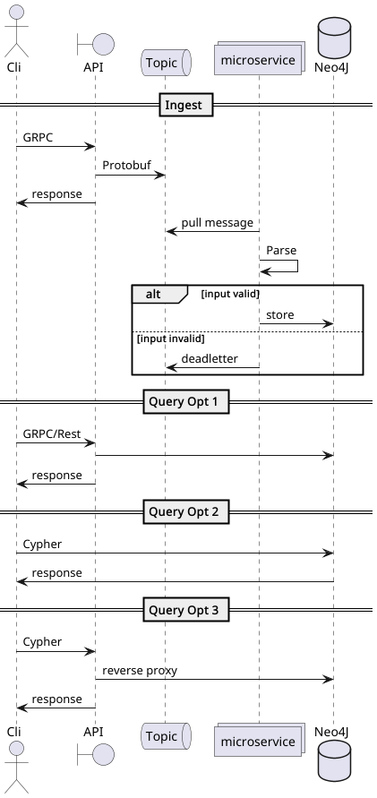

# Process Data Ingestion Architecture

## Overview

This document outlines the proposed architecture for a system designed to:

* Collect process list data from multiple host systems
* Provide flexible data exploration capabilities for data scientists
* Support horizontal scaling to accommodate increased load
* Implement robust error handling

## Ingestion Architecture

### Host Agent Functionality

The agent deployed on each host will:

1. **Collect process data** at regular intervals
   * For cross-platform consistency across UNIX systems, use the command:
     ```
     ps -e -o user,pid,%cpu,%mem,vsz,rss,tty=TTY,stat,start,time,args=COMMAND|head -n 1
     ```

2. **Transmit data** to an API endpoint using:
   * Protocol: gRPC
   * Serialization: Protocol Buffers (Protobuf)
   * Benefits: Type safety, schema validation, efficient serialization

### API Layer

Upon receiving data, the API will:

1. **Authenticate requests**
   * Validate using API keys paired with machine identifiers
   * Ensure data is from authorized sources

2. **Forward validated data** to a Kafka topic
   * Advantages of Kafka implementation:
     * Service decoupling
     * Independent scaling of publishers and subscribers
     * Message replay capability for reprocessing when needed

### Data Processing

A lightweight service will:

1. **Subscribe** to the Kafka ingestion topic
2. **Process messages** and perform upsert operations to Neo4j
   * Invalid messages will be forwarded to a `deadletter` topic for late inspection.
   * Upsert operations ensure idempotence for duplicate messages
   * Supports data reprocessing scenarios

## Neo4j as the Data Store

Neo4j was selected as the primary data store for the following advantages:

* **Natural representation of relationships**: The graph structure efficiently models connections between processes and system entities
* **Query performance**: Relationship traversal operations have O(N) complexity, compared to O(N²) in relational databases
* **Exploration flexibility**: Data scientists can traverse relationships in any direction without complex join operations
* **Visualization capabilities**: The Neo4j web interface provides visual insights that can reveal patterns not easily detected in tabular data

## Data Access Options

The following approaches can be implemented for data scientist access, depending on organizational requirements:

1. **Direct database access**
   * Scientists connect directly to Neo4j using:
     * The Neo4j web interface
     * Python or Go clients
     * Command-line tools with Cypher queries

2. **API-mediated access**
   * All queries pass through an authentication layer
   * API acts as a secure reverse proxy to the database
   * Provides additional security and access control

3. **Structured query interface**
   * Implementation of GraphQL or a domain-specific ORM 
   * Provides a structured object-based query approach
   * More development effort required initially
   * May constrain some exploration flexibility

## Suggested Model

### Nodes
* **User**: represent the logged on user
* **Host**: represent the machine & OS where the process where collected
* **Process**: the collected process


## System Flow

As can be seen in the `plantuml` file `design/overview.puml`


